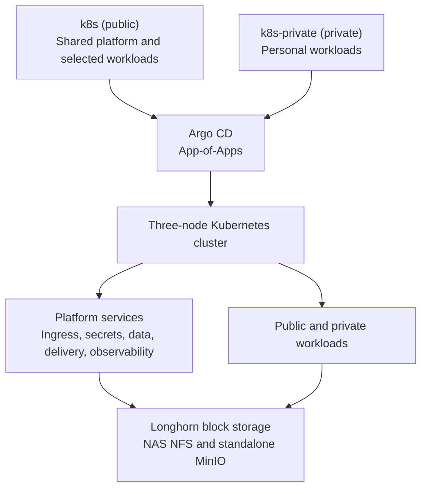

# ShivWS

ShivWS is the GitOps application layer for a three-node bare-metal Kubernetes
homelab. I use it to operate shared platform services and self-hosted
workloads, with desired state split between this public repository and a
private workload repository.

> This repository starts at the application-delivery layer. Node provisioning,
> Kubernetes bootstrap, network-appliance configuration, live secret values,
> and break-glass procedures are outside its scope.

## Current Footprint

Snapshot verified against both Git sources and the live cluster on 2026-08-06.

| Area | Current state |
|---|---|
| Compute | Three bare-metal control-plane nodes with dedicated NAS storage |
| GitOps inventory | 63 Argo CD Applications across the public and private repositories |
| Packaging | 60 Helm chart directories: 47 public and 13 private |
| Public source | Shared controllers, data services, observability, delivery tooling, and selected applications |
| Private source | 11 active personal workload Applications plus one source-only, disabled chart |

The Application count includes Argo CD roots, platform controllers, data
services, and workloads. It is not a claim of 63 user-facing services.

## Hardware

| Role | Hardware | Capacity and connectivity |
|---|---|---|
| Compute | 3x Minisforum MS-A2 | AMD Ryzen 9 9955HX, 64 GB RAM, 1 TB NVMe, and 10 GbE per node |
| Storage | UniFi UNAS Pro 8 | 56 TB usable RAID 6, 2 TB NVMe cache, and 10 GbE |
| Network edge | UniFi USW Aggregation and Cloud Gateway Fiber | 10 GbE compute/storage fabric with a dedicated routing and firewall boundary |

All compute nodes and the NAS connect through the 10 GbE aggregation switch.
The NAS is dedicated to storage and does not run Kubernetes workloads.
Latency-sensitive volumes use Longhorn-managed node storage, while bulk and
shared datasets use NFS. Hardware and network provisioning remain outside this
repository.

## Desired-State Architecture



The public [Application inventory](apps/argocd-apps/values.yaml) also creates
the private root Application. Most child Applications use automated sync,
self-healing, and pruning. Argo CD itself remains manual-sync, and pruning is
disabled selectively where an automatic delete would carry a larger state or
control-plane risk.

## Platform Surface

| Area | Implementation and evidence |
|---|---|
| GitOps and delivery | [Argo CD App-of-Apps](apps/argocd-apps/), [Argo Rollouts](apps/argo-rollouts/), [canary](apps/canary-demo/), and [blue-green](apps/rollouts-demo/) examples |
| Networking | [Traefik](apps/traefik/), [MetalLB](apps/metallb/), [cert-manager](apps/cert-manager/), and [Cloudflare Tunnel](apps/cloudflared/) |
| Identity and secrets | [Vault with Raft storage](apps/vault/) and [External Secrets Operator](apps/external-secrets/) |
| Data and storage | A [three-instance CloudNativePG cluster](apps/postgresql/templates/cluster.yaml), Redis, MongoDB, Kafka, RabbitMQ, Longhorn, NAS NFS, and standalone MinIO |
| Observability | Prometheus, Grafana, Alertmanager, Loki, Tempo, Pyroscope, Alloy, and Datadog integrations |
| Policy and scanning | Kyverno, Policy Reporter, and Trivy provide policy and vulnerability-reporting infrastructure; custom policy coverage is still being developed |
| CI infrastructure | Autoscaling [GitHub Actions runners](apps/github-actions-runners/) and isolated [Docker runners](apps/github-actions-docker-runners/) managed with Actions Runner Controller |

These components provide platform capabilities; their presence does not imply
that every workload has identical authentication, telemetry, policy, or
availability coverage.

## Selected Engineering Decisions

### Reconciliation with explicit failure boundaries

Application reconciliation is Git-driven, but automation is not treated as an
absolute. The [Argo CD configuration](apps/argocd-apps/values.yaml) keeps the
controller's own upgrade manual and disables pruning for selected stateful or
control-plane components. This reduces the blast radius of a bad desired-state
change while retaining self-healing for normal workloads.

### Secrets stay referenced in Git

Vault is the credential authority for most workloads. External Secrets reads
Vault references and materializes ordinary Kubernetes Secret objects for
applications. This keeps live credential values out of Git without making a
broader claim about Kubernetes Secret or etcd storage.

### Storage is selected per workload

[Longhorn](apps/longhorn/) provides block storage with a two-replica default
and an explicit one-replica class for data with a different durability/cost
tradeoff. Large shared datasets use NAS-backed NFS. [MinIO](apps/minio/) is a
single instance on NFS and is not described as a distributed object store.

### Telemetry coverage is incremental

[Prometheus and Grafana](apps/kube-prometheus-stack/) provide metrics,
dashboards, and alerting. [Alloy](apps/alloy/) centralizes logs and exposes
receivers for traces; Tempo and Pyroscope support instrumented or annotated
workloads. The repository describes the telemetry platform, not universal
end-to-end instrumentation.

### CI runners are workloads, not pets

The runner charts use bounded autoscaling, non-root containers, dropped
capabilities, disabled service-account token mounting, namespace quotas, and
targeted network policies. See the
[runner values](apps/github-actions-runners/values.yaml) and
[network policy](apps/github-actions-runners/templates/network-policy.yaml).

## Change and Validation Path

```text
Pull request
  ├─ changed Helm app: helm lint + helm template
  └─ changed non-template YAML: relaxed yamllint

Merge to main
  └─ Argo CD reconciles automated Applications

Renovate
  └─ opens Helm dependency updates; non-major updates are grouped
```

The workflows are intentionally described narrowly:

- [Helm CI](.github/workflows/helm-lint.yaml) checks changed chart directories,
  not every chart on every pull request.
- [YAML CI](.github/workflows/yaml-lint.yaml) is syntax/style linting for
  changed non-template YAML, not Kubernetes schema or integration validation.
- [Renovate](renovate.json) tracks Helm dependencies, not container image tags.
- [Gitleaks](.pre-commit-config.yaml) is available as a local pre-commit check.

## Review Path

For a focused code review, start with:

1. [Application ownership and sync policy](apps/argocd-apps/values.yaml)
2. [PostgreSQL topology and managed roles](apps/postgresql/templates/cluster.yaml)
3. [Operational alert rules](apps/kube-prometheus-stack/templates/homelab-observability-rules.yaml)
4. [Self-hosted runner isolation](apps/github-actions-runners/)
5. [Progressive-delivery examples](apps/canary-demo/rollout.yaml)

## Scope and Current Priorities

This is a personal, single-site lab used to practice production-oriented
platform engineering. It is not presented as a customer production
environment or an SLA-backed service.

- Git records desired state; this README is not a point-in-time availability
  report.
- Availability, replication, authentication, and instrumentation vary by
  workload. A three-node cluster does not make every component highly
  available.
- Backup configuration, successful restore drills, and measured RPO/RTO are
  not currently versioned here, so no disaster-recovery guarantee is claimed.
- Kyverno and Policy Reporter are installed, but committed custom policy
  coverage is not yet comprehensive.

The next engineering priorities are to add repeatable recovery evidence,
version policy guardrails, narrow Argo project permissions, strengthen
dependency and raw-manifest validation, and replace remaining mutable image
references.

## Repository Layout

```text
apps/
├── argocd/                 # Argo CD configuration
├── argocd-apps/            # Public and private Application inventory
├── <platform>/             # Shared platform Helm wrappers and templates
└── <workload>/             # Selected public workload configuration

.github/workflows/          # Changed-chart and YAML validation
renovate.json               # Helm dependency update policy
```

Normal application changes should flow through Git and Argo CD. Cluster
bootstrap and documented break-glass operations are explicit exceptions.
